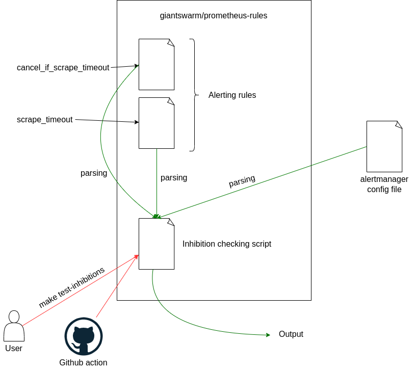

[](https://circleci.com/gh/giantswarm/prometheus-rules)

# Prometheus rules chart

**What is this app?**

This repository contains Giant Swarm alerting and recording rules


### Alerting

The alerting rules are located in `helm/prometheus-rules/templates/alerting-rules`

#### How alerts are structured

At Giant Swarm we follow some best practices to organize our alerts:

here is an example:

```yaml
  groups:
  - name: app
    rules:
    - alert: ManagementClusterAppFailedAtlas
        annotations:
            description: '{{`Management Cluster App {{ $labels.name }}, version {{ $labels.version }} is {{if $labels.status }} in {{ $labels.status }} state. {{else}} not installed. {{end}}`}}'
            opsrecipe: app-failed/
            dashboard: UniqueID/app-failed
        expr: app_operator_app_info{status!~"(?i:(deployed|cordoned))", catalog=~"control-plane-.*",team="atlas"}
        for: 30m
        labels:
            area: managedservices
            cancel_if_cluster_status_creating: "true"
            cancel_if_cluster_status_deleting: "true"
            cancel_if_cluster_status_updating: "true"
            cancel_if_outside_working_hours: "true"
            severity: page
            sig: none
            team: atlas
```

Any Alert includes:

* Mandatory annotations:
  - `description`

* Recommended annotations:
  - [opsrecipe](https://intranet.giantswarm.io/docs/support-and-ops/ops-recipes/)
  - `dashboard` reference, built from `uid`/`title` in dashboard definition or copied from existing link.
      - If you dashboard has no `uid` make sure to update it with one, otherwise `uid` will differ between installations.
      - Title is not used as-is: punctuation, spaces, upper case letters are changed. Look at the name in the dashboard URL on a grafana instance to check the right syntax.

* Mandatory labels:
   - `area`
   - `team`
   - `severity`

* Optional labels:
   - `sig`
   - `cancel_if_.*`


### Specific alert labels

- `all_pipelines: true`: When adding this label to an alert, you are sure the alert will be send to opsgenie, even if the installation is not a stable installation.

#### Routing

Alertmanager does the routing based on the labels menitoned above.
You can see the routing rules in alertmanager's config (opsctl open `alertmanager`, then go to `Status`), section `route:`.

* are sent to opsgenie:
  * all `severity=page` alerts
* are sent to slack team-specific channels:
  * `severity=page` or `severity=notify`
  * `team` defines which channel to route to.


##### Opsgenie routing

Opsgenie routing is defined in the `Teams` section of the Opsgenie application.

Opsgenie route alerts based on the `team` label.


#### Inhibitions

The `cancel_if_*` labels are used to inhibit alerts, they are defined in [Alertmanager's config](https://github.com/giantswarm/prometheus-meta-operator/blob/master/files/templates/alertmanager/alertmanager.yaml#L341).

The base principle is: if an alert is currently firing with a `source_matcher` label, then all alerts that have a `target_matcher` label are inhibited (or muted).

To make inhibitions easier to read, let's try to follow this naming convention inhibition-related labels:
* `inhibit_[something]` for `source` matchers
* `cancel_if_[something]` for `target` matchers

Official documentation for inhibit rules can be found here: https://www.prometheus.io/docs/alerting/latest/configuration/#inhibit_rule

### Recording rules

The recording rules are located `helm/prometheus-rules/templates/recording-rules`

### Mixin

#### kubernetes-mixins

To Update `kubernetes-mixins` recording rules:

* Follow the instructions in [giantswarm-kubernetes-mixin](https://github.com/giantswarm/giantswarm-kubernetes-mixin)
* Run `./scripts/sync-kube-mixin.sh (?my-fancy-branch-or-tag)` to updated the `helm/prometheus-rules/templates/recording-rules/kubernetes-mixins.rules.yml` folder.
* make sure to update [grafana dashboards](https://github.com/giantswarm/dashboards/tree/master/helm/dashboards/dashboards/mixin)

#### mimir-mixins

Come as-is from https://github.com/grafana/mimir/tree/main/operations/mimir-mixin-compiled ; just added helm headers (metadata, spec...)

#### loki-mixins

Come as-is from https://github.com/grafana/loki/tree/main/production/loki-mixin-compiled-ssd ; just added helm headers (metadata, spec...)

#### tempo-mixins

Come as-is from https://github.com/grafana/tempo/tree/main/operations/tempo-mixin-compiled ; just added helm headers (metadata, spec...)

### Testing

You can run all tests by running `make test`.

There are 3 different types tests implemented:

- [Prometheus rules unit tests](#prometheus-rules-unit-tests)
- [Alertmanager inhibition dependency check](#alertmanager-inhibition-dependency-check)
- [Opsrecipe check](#opsrecipe-check)

---

### Prometheus rules unit tests

By creating unit tests for Alerting rules it's possible to get early feedback about possible misbehavior in alerting rules.
Unit tests are executed via `promtool` (part of `prometheus`).

By running `make test-rules` in your local environment, all required binaries will be downloaded and tests will be executed.

There are 2 kinds of tests on rules:
- syntax check (promtool check) - run on all files that can be generated from helm, nothing specific to do
- unit tests (promtool test) - you have to write some unit tests, or add your rules files to the `promtool_ignore` file.

#### Writing new Alerting rules unit tests

1. remove the rules file you would like to test from `test/conf/promtool_ignore`
1. create a new test file in [unit testing rules] format either globally in `test/tests/providers/global/` or provider-specific in `test/tests/providers/<provider>/`
1. by running `make test-rules` you can validate your testing rules.
   Output should look like the follows:

   ```
   [...]
   ### Skipping templates/alerting-rules/calico.rules.yml
   ### Testing templates/alerting-rules/capi.rules.yml
   ###    Provider: capa
   ###    extracting /home/marioc/go/src/github.com/giantswarm/prometheus-rules/test/providers/capa/capi.rules.yml
   ###    promtool check rules /home/marioc/go/src/github.com/giantswarm/prometheus-rules/test/tests/providers/capa/capi.rules.yml
   ###    promtool test rules capi.rules.test.yml
   ### Skipping templates/alerting-rules/cert-manager.rules.yml
   ### Skipping templates/alerting-rules/certificate.all.rules.yml
   [...]
   09:06:29 promtool: end (Elapsed time: 1s)
   Congratulations!  Prometheus rules have been promtool checked and tested
   ```

#### Test syntax

When writing unit tests, the first thing to do is to "feed" the testing tool with input series. Unfortunately, the official documentation does not give a lot of information about the tests syntax, especially for the `input_series`.

For each `input_series`, one has to provide a prometheus timeseries as well as its values over time :

```
[...]
tests:
  - interval: 1m
    input_series:
      - series: '<prometheus_timeseries>'
        values: "_x20 1+0x20 0+0x20"
      - series: '<prometheus_timeseries>'
        values: "0+600x40 24000+400x40"
[...]
```

Let's breakdown the above example:
* For the first input series, the prometheus timesies returns an `empty query result` for 20 minutes (20*interval), then it is returning the value `1` for 20 minutes. Finally, it is returning the value `0` for 20 minutes.
This is a good example of an input series for testing an `up` query.
* The second series introduce a timeseries which first returns a `0` value and which adds `600` every minutes (=interval) for 40 minutes. After 40 minutes it has reached a value of `24000` (600x40) and goes on by adding `400` every minutes for 40 more minutes.
This is a good example of an input series for testing a `range` query.

#### Test exceptions

* Rule files that can't be tested are listed in `test/conf/promtool_ignore`.
* Rule files that can't be tested with a specific provider are listed in `test/conf/promtool_ignore_<provider>`.

#### Limitation

* The current implementation only renders rules for different providers via the helm value `managementCluster.provider.kind`.
Any other decision in the current helm chart is ignored for now (e.g. `helm/prometheus-rules/templates/alerting-rules/alertmanager-dashboard.rules.yml`)

#### A word on the testing logic

Here is a simplistic pseudocode view of the generate&test loop:
```
for each provider from test/conf/providers:
  for each file in helm/prometheus-rules/templates/alerting-rules:
    generate the rule using helm template
    if generation fails:
      we will try with next provider
    else:
      check rules syntax
      keep track that this file's syntax has been tested

    if no ignore on the file:
      run unit tests

Show a summary of encountered errors
Show success
```

#### Hints & tips

##### Run selected tests

You can filter which rules files you will test with a regular expression:
```
make test-rules test_filter=grafana.management-cluster.rules.yml
make test-rules test_filter=grafana
make test-rules test_filter=gr.*na
```

#### Test "no data" case

* It can be nice to test what happens when serie does not exist.
* For instance, You can have your first 60 iterations with no data like this: `_x60`

#### Useful links

* PromQL cheatsheet: https://promlabs.com/promql-cheat-sheet/
* Promlens - explain promql queries: https://demo.promlens.com/
* Awesome prometheus alerts - library of queries: https://awesome-prometheus-alerts.grep.to/

### SLO Framework integration

In order to incorporate the SLO Framework in the Prometheus rules, several rules need to be implemented :
* One which will record the amount of requests for the designated target
* One recording the amount of errors for the same target
* One recording the targeted availability (for exemple 99.9% availability)
  * For more information concerning the SLO target availabity and corresponding uptime : https://uptime.is/99.9

Those rules can be written according to this template :
```
# Amout of requests for VPA
- expr: "count(up{app=~'vertical-pod-autoscaler.*'}) by (cluster_type,cluster_id)"
  labels:
    class: MEDIUM
    area: platform
    service: vertical-pod-autoscaler
  record: raw_slo_requests

# Amout of errors for VPA
# Up metric is set to 1 for each successful scrape and set to 0 otherwise.
# If up made a successful scrape, there is no error. Up returns 1, multiplied by -1
# and summed with 1 so the final result is 0 : no error recorded.
# If up was unsuccessful, there is an error. Up returns 0, multiplied by -1 and summed
# with 1 so the final result is 1 : 1 error is recorded .
- expr: "sum((up{app=~'vertical-pod-autoscaler.*'} * -1) + 1) by (cluster_id, cluster_type)"
  labels:
    class: MEDIUM
    area: platform
    service: vertical-pod-autoscaler
  record: raw_slo_errors

# SLO targets -- 99,9% availability
- expr: "vector((1 - 0.999))"
  labels:
    area: platform
    service: vertical-pod-autoscaler
  record: slo_target
```

[unit testing rules]: https://prometheus.io/docs/prometheus/latest/configuration/unit_testing_rules/

## Alertmanager inhibition dependency check

In order for Alertmanager inhibition to work we need 3 elements:
  - an Alerting rule with some source labels
  - an Inhibition definition mapping source labels to target labels in the alertmanager config file
  - an Alert rule with some target labels

An alert having a target label will be inhibited whenever the condition specified in the target label's name is fulfilled. This is why target labels' names are most of the time prefixed by "cancel_if_" (e.g "cancel_if_scrape_timeout").

An alert with a source label will define the conditions under which the target label is effective. For example, if an alert with the "scrape_timeout" label were to fire, all other alerts having the corresponding target label, i.e "cancel_if_scrape_timeout" would be inhibited.

This is possible thanks to the alertmanager config file stored in the Prometheus-Meta-operator which defines the target/source labels coupling.

This is what we call the inhibition dependency chain.

One can check whether inhibition labels (mostly "cancel_if_" prefixed ones) are well defined and triggered by a corresponding label in the alerting rules by running the `make test-inhibitions` command at the projet's root directory.

This command will output the list of missing labels. Each of them will need to be defined in either the alerting rules or the alertmanager config file depending on its nature : either an inhibition label or its source label.
If there is no labels outputed, this means tests passed and did not find missing inhibition labels.



The inhibition labels checking script is also run automatically at PR's creation and will block merging when it fails.

### Limitations (might happen)

- Inhibition checking script does not trigger at PR's creation : stuck in `pending` state. Must push empty commit to trigger it
- When ran for the first time in a PR (after empty commit) usually fails to retrieve the alertmanager config file's data and thus fires error stating that all labels are missing.
- Must manually re-run the action for it to pass

## Opsrecipe check

You can run `make test-opsrecipes` to check if linked opsrecipes are valid.

This check is not part of the global `make test` command until we fix all missing / wrong opsrecipes.
